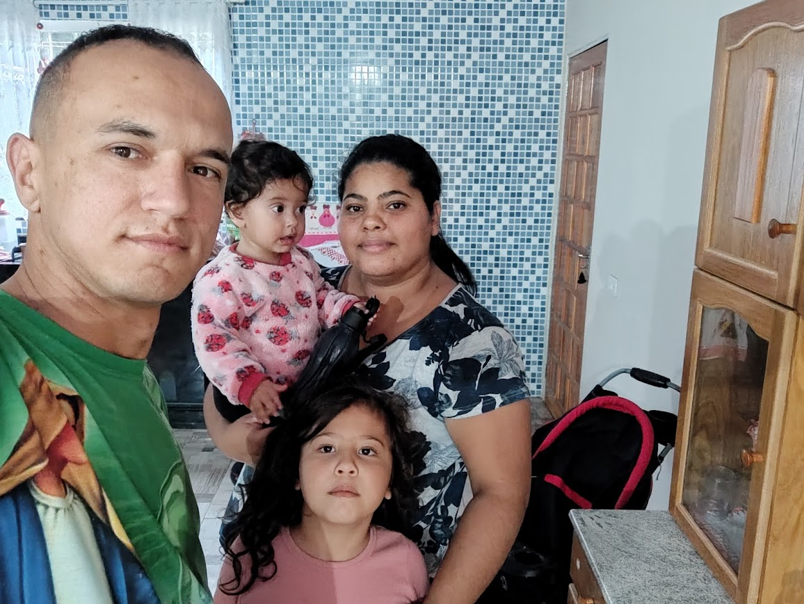

<h1 align="center">

</h1>

  
  

 
- 👨‍💻 Gosto de computação
 
 
- 😉Formatação
 
 
- 💞️ CMD 
 
 
- 💻 Modificar bios de notebook 
 
 
- 🤔 Front-end
 
 
- 🤯 Back-end
 
 
- 💞 Javascript
 
 
- 💰 style.css
 
 
- 🕸️ index.html

 

 
Contatos
 
 

 
  
  
  
   

 
<h1 align="center">

</h1>

###

###

