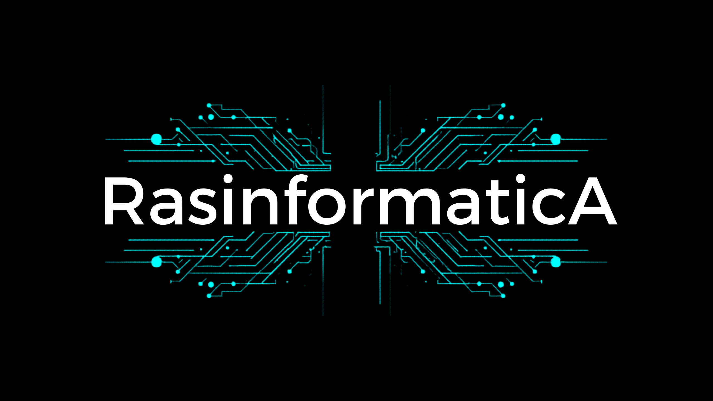

 

---

  

---

### 💫 Sobre Mim

🤔 **Front-end** • 🤯 **Back-end** • 📜 **JavaScript** • 👨‍💻 **Técnico de Informática**

---

### 🛠️ Tecnologias & Ferramentas

 

---

### 📬 Vamos nos conectar!

 

---

### 📊 Estatísticas do GitHub

  

---

### 🐍 Contribuições

 

---

